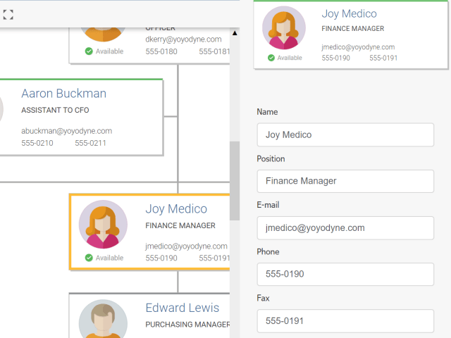

# Vue.js Integration Demo

[You can also run this demo online](https://live.yworks.com/demos/toolkit/vuejs/index.html).

# Vue.js Integration Demo

Shows how to use yFiles for HTML with Vue.js.

The following Vue.js features are shown:

- The yFiles `GraphComponent` is wrapped as a Vue component.
- A custom node style renders nodes using Vue components.
- A separate view shows the currently selected node using the same Vue component that renders the graph nodes.
- Employee properties can be edited using v-model bindings. The properties will update automatically in all views.
- The currently selected item is propagated to the application component using a Vue custom event.

## App Generator

Use the [App Generator](https://www.yworks.com/products/app-generator) to create visualization prototypes – quickly and easily.
