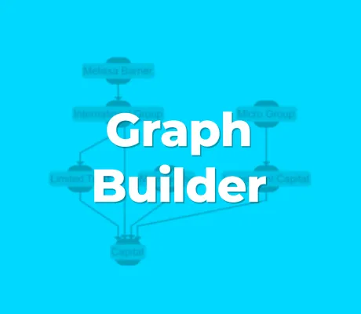

<!--
 //////////////////////////////////////////////////////////////////////////////
 // @license
 // This file is part of yFiles for HTML.
 // Use is subject to license terms.
 //
 // Copyright (c) by yWorks GmbH, Vor dem Kreuzberg 28,
 // 72070 Tuebingen, Germany. All rights reserved.
 //
 //////////////////////////////////////////////////////////////////////////////
-->
# 01 Create Graph - Tutorial: Graph Builder



[You can also run this demo online](https://www.yfiles.com/demos/tutorial-graph-builder/01-create-graph/).

This tutorial will guide you through configuring [GraphBuilder](https://docs.yworks.com/yfileshtml/#/api/GraphBuilder) to conveniently transfer business data into a graph that you can display, manage and explore.

[GraphBuilder](https://docs.yworks.com/yfileshtml/#/api/GraphBuilder) is a class which supports loading data from different — and even multiple — sources. It uses the data to construct the graph structure and provides multiple options to assign visualizations to the graph elements and add labels.

Another feature of [GraphBuilder](https://docs.yworks.com/yfileshtml/#/api/GraphBuilder) is the possibility to update the graph when the business data changes. It allows for specific changes without rebuilding the graph from scratch.

## Using GraphBuilder

Before starting with [GraphBuilder](https://docs.yworks.com/yfileshtml/#/api/GraphBuilder), let’s have a look at some sample data. It describes two entities representing two persons and a connection between them.

```
const data = {
  persons: [
    { id: '0', name: 'Erik Joplin' },
    { id: '1', name: 'Melissa Barner' }
  ],
  relationships: [{ id: '0', sourceId: '0', targetId: '1' }]
}
```

In this case, there are two arrays that contain objects with business data which are associated with an `id` to be able to reference them in connections or during updates.

Now, we are using [GraphBuilder](https://docs.yworks.com/yfileshtml/#/api/GraphBuilder) to create a graph containing two nodes that are connected. First, we create an instance of [GraphBuilder](https://docs.yworks.com/yfileshtml/#/api/GraphBuilder) and associate it with an [IGraph](https://docs.yworks.com/yfileshtml/#/api/IGraph) instance. Most often the [GraphComponent’s graph](https://docs.yworks.com/yfileshtml/#/api/GraphComponent#GraphComponent-property-graph) property is used for this purpose. Then, data sources are added for nodes and for edges. Finally, `buildGraph()` creates the graph.

```
// use the graph from the graph component, for example
const graph = graphComponent.graph

// instantiate the graph builder
const graphBuilder = new GraphBuilder(graph)

// add node and edge data
graphBuilder.createNodesSource(data.persons, 'id')
graphBuilder.createEdgesSource({
  data: data.relationships,
  id: 'id',
  sourceId: 'sourceId',
  targetId: 'targetId'
})

// create the graph
graphBuilder.buildGraph()
```

The graph on the right shows the result of this example.

Note

The above code snippets are taken from `create-graph.ts` which is part of this tutorial demo code. Try to change the data in the source file to observe how the graph changes.

## Importing specific data structures

This tutorial focuses on the [GraphBuilder](https://docs.yworks.com/yfileshtml/#/api/GraphBuilder) class which is used when the data describes a general graph with information about nodes and edges.

There are two other graph builder classes that are better suited for specific scenarios: [TreeBuilder](https://docs.yworks.com/yfileshtml/#/api/TreeBuilder) and [AdjacencyGraphBuilder](https://docs.yworks.com/yfileshtml/#/api/AdjacencyGraphBuilder). In principle, they work the same as [GraphBuilder](https://docs.yworks.com/yfileshtml/#/api/GraphBuilder). They only differ in the way the node and edge sources are configured.

[TreeBuilder](https://docs.yworks.com/yfileshtml/#/api/TreeBuilder) is designed to create a graph from data that has a tree structure and [AdjacencyGraphBuilder](https://docs.yworks.com/yfileshtml/#/api/AdjacencyGraphBuilder) applies when the connections between the elements are not separately specified in the data.

See the steps about [AdjacencyGraphBuilder](../12-adjacency-graph-builder/) and [TreeBuilder](../13-tree-builder/) of this tutorial for an explanation on how these classes work.

[02 Create Nodes Sources](../../tutorial-graph-builder/02-create-nodes-sources/)
