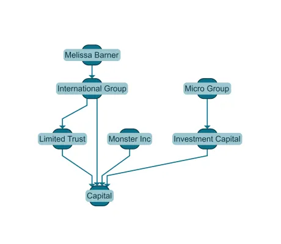

<!--
 //////////////////////////////////////////////////////////////////////////////
 // @license
 // This file is part of yFiles for HTML.
 // Use is subject to license terms.
 //
 // Copyright (c) by yWorks GmbH, Vor dem Kreuzberg 28,
 // 72070 Tuebingen, Germany. All rights reserved.
 //
 //////////////////////////////////////////////////////////////////////////////
-->
# 09 Configure Tags - Tutorial: Graph Builder



[You can also run this demo online](https://www.yfiles.com/demos/tutorial-graph-builder/09-configure-tags/).

By default, [GraphBuilder](https://docs.yworks.com/yfileshtml/#/api/GraphBuilder) stores each business data item in the corresponding graph element’s [tag](https://docs.yworks.com/yfileshtml/#/api/IModelItem#ITagOwner-property-tag).

In this tutorial step, you will learn how to use a [tag provider](https://docs.yworks.com/yfileshtml/#/api/NodeCreator#NodeCreator-property-tagProvider) to customize the data available on the [tag](https://docs.yworks.com/yfileshtml/#/api/IModelItem#ITagOwner-property-tag). This can come in handy, when you want to augment your data with additional information or when you want to strip parts of the original business data, to lower the memory load of the built graph for instance.

Note

This step is optional when building a graph with [GraphBuilder](https://docs.yworks.com/yfileshtml/#/api/GraphBuilder). If you do not want to augment the data in the node’s tag, you can proceed with the next step.

## Original business data

The dataset for this tutorial step represents a company ownership diagram and can be found in `ownership-data.json` of this tutorial step’s demo code. This dataset contains items like this:

```
type EntityData = {
  id: string
  name: string
  type: 'Trust' | 'Corporation' | 'Branch' | 'PE_Risk'
  currency?: string
  jurisdiction?: string[]
}
```

## Desired tag data

Assume now that for each node, we need to store only the information about the name and the type of each business entity and for each edge only the ownership.

The desired [tag](https://docs.yworks.com/yfileshtml/#/api/IModelItem#ITagOwner-property-tag) types should then look like this:

```
type OwnerData = {
  name: string
  type: string
}
```

## Configuring the tag provider

For the custom [tag](https://docs.yworks.com/yfileshtml/#/api/IModelItem#ITagOwner-property-tag) creation, a [tag provider](https://docs.yworks.com/yfileshtml/#/api/NodeCreator#NodeCreator-property-tagProvider) is required that will return an object with the values of the `name` and `type` property of the nodes created by the specific [NodesSource](https://docs.yworks.com/yfileshtml/#/api/NodesSource).

```
// configure the provider that returns an object with the name and the type property of the nodes
nodesSource.nodeCreator.tagProvider = (data): OwnerData => {
  return { name: data.name, type: data.type }
}
```

Custom creation of edge and label tags works the same way as for node tags. Simply define a tag provider on EdgeCreator or LabelCreator.

Note

Please have a look in this tutorial step’s demo code in `configure-tags.ts` and play around with the example data and different `tag` configurations.

[10 Configure Layout](../../tutorial-graph-builder/10-configure-layout/)
