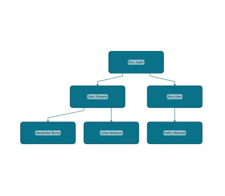

<!--
 //////////////////////////////////////////////////////////////////////////////
 // @license
 // This file is part of yFiles for HTML.
 // Use is subject to license terms.
 //
 // Copyright (c) by yWorks GmbH, Vor dem Kreuzberg 28,
 // 72070 Tuebingen, Germany. All rights reserved.
 //
 //////////////////////////////////////////////////////////////////////////////
-->
# 12 Adjacency Graph Builder - Tutorial: Graph Builder



[You can also run this demo online](https://www.yfiles.com/demos/tutorial-graph-builder/12-adjacency-graph-builder/).

In this tutorial step we show how to use [AdjacencyGraphBuilder](https://docs.yworks.com/yfileshtml/#/api/AdjacencyGraphBuilder) to build a graph from data, where the relationship information between the nodes is part of the node data entry.

## The data

Consider the following list of data objects, which represents a basic organization chart. In this example, every data object has an `id` and _optionally_ a `colleagues` property. The `colleagues` property, if available, contains a list with the `id`s of the _colleagues_ of the associated node object.

```
{
  id: '0',
  position: 'Chief Executive Officer',
  name: 'Eric Joplin',
  colleagues: ['0_0', '0_1']
},
{
  id: '0_0',
  position: 'Chief Executive Assistant',
  name: 'Gary Roberts',
  colleagues: ['0_0_0', '0_0_1']
},
{
  id: '0_0_0',
  position: 'Senior Executive Assistant',
  name: 'Alexander Burns'
},
{
  id: '0_0_1',
  position: 'Junior Executive Assistant',
  name: 'Linda Newland'
},
{
  id: '0_1',
  position: 'Vice President of Production',
  name: 'Amy Kain',
  colleagues: ['0_1_0']
},
{
  id: '0_1_0',
  position: 'Production Supervisor',
  name: 'Kathy Maxwell'
}
```

## Building the graph

In the first step, we instantiate the [AdjacencyGraphBuilder](https://docs.yworks.com/yfileshtml/#/api/AdjacencyGraphBuilder) and configure an [AdjacencyNodesSource](<https://docs.yworks.com/yfileshtml/#/api/AdjacencyNodesSource(TDataItem)>).

```
const adjacencyGraphBuilder = new AdjacencyGraphBuilder(graph)

const adjacencyNodesSource = adjacencyGraphBuilder.createNodesSource(
  nodesData,
  (item) => item.id
)
```

In the second step, we configure the _colleagues_ or _successors_ on the [AdjacencyNodesSource](<https://docs.yworks.com/yfileshtml/#/api/AdjacencyNodesSource(TDataItem)>). For edge creation, we use an [EdgeCreator](https://docs.yworks.com/yfileshtml/#/api/EdgeCreator) with a default configuration.

```
adjacencyNodesSource.addSuccessorIds(
  (data) => data.colleagues,
  new EdgeCreator({ defaults: graph.edgeDefaults })
)
```

Finally, we add labels to the graph building process by providing a label binding for the [NodesSource](https://docs.yworks.com/yfileshtml/#/api/NodesSource)'s [NodeCreator](https://docs.yworks.com/yfileshtml/#/api/NodeCreator).

```
adjacencyNodesSource.nodeCreator.createLabelBinding({
  text: (dataItem) => dataItem.name
})
```

Note

[AdjacencyGraphBuilder](https://docs.yworks.com/yfileshtml/#/api/AdjacencyGraphBuilder) supports the same labeling functionality as the [GraphBuilder](https://docs.yworks.com/yfileshtml/#/api/GraphBuilder).

In this tutorial step, we built a graph with [AdjacencyGraphBuilder](https://docs.yworks.com/yfileshtml/#/api/AdjacencyGraphBuilder) using the `id`s provided by the data entries for the calculation of _successors._ Of course, it is also possible to define _predecessors_ in a similar manner.

Yet another functionality of [AdjacencyGraphBuilder](https://docs.yworks.com/yfileshtml/#/api/AdjacencyGraphBuilder) is to use predecessor/successor _sources_. See the [AdjacencyGraphBuilder Developer’s Guide](https://docs.yworks.com/yfileshtml/#/dguide/graph_builder-AdjacencyGraphBuilder) for an in-depth discussion.

Note

Please have a look in this tutorial step’s demo code in `adjacency-graph-building.ts` and play around with the different ways to import business data.

[13 Tree Builder](../../tutorial-graph-builder/13-tree-builder/)
