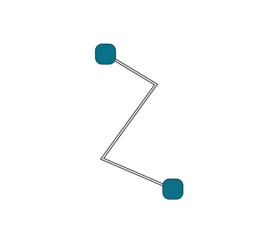

<!--
 //////////////////////////////////////////////////////////////////////////////
 // @license
 // This file is part of yFiles for HTML.
 // Use is subject to license terms.
 //
 // Copyright (c) by yWorks GmbH, Vor dem Kreuzberg 28,
 // 72070 Tuebingen, Germany. All rights reserved.
 //
 //////////////////////////////////////////////////////////////////////////////
-->
#

      03 Create Parallel Polylines - Tutorial: Edge Style Implementation



[You can also run this demo online](https://www.yfiles.com/demos/tutorial-style-implementation-edge/03-create-parallel-polylines/).

Currently, the custom edge style renders a simple polyline. This is something yFiles for HTML already offers out-of-the box with [PolylineEdgeStyle](https://docs.yworks.com/yfileshtml/#/api/PolylineEdgeStyle). So let’s use something more interesting, for example two polylines running parallel.

Since calculating the offset path of the parallel lines is complex, we imitate this look by rendering a white line on top of a wider black line. We start by rendering a black path of wide width along the edge.

```
const widePath = croppedGeneralPath.createSvgPath()
widePath.setAttribute('fill', 'none')
widePath.setAttribute('stroke', 'black')
widePath.setAttribute('stroke-width', '4')
```

Then, we render a path of narrower width on top of the black one. The path gets the same color as the canvas’s background, which is currently set to white.

```
const thinPath = croppedGeneralPath.createSvgPath()
thinPath.setAttribute('fill', 'none')
thinPath.setAttribute('stroke', 'white')
thinPath.setAttribute('stroke-width', '2')
```

Finally, we combine both paths into an SVG group and return it as a SVG visual. It is important that we add the wide path first and then the thin path, resulting in the white path rendering above the black path.

```
const group = document.createElementNS('http://www.w3.org/2000/svg', 'g')
group.append(widePath, thinPath)
return new SvgVisual(group)
```

[04 Render Performance](../../tutorial-style-implementation-edge/04-render-performance/)
