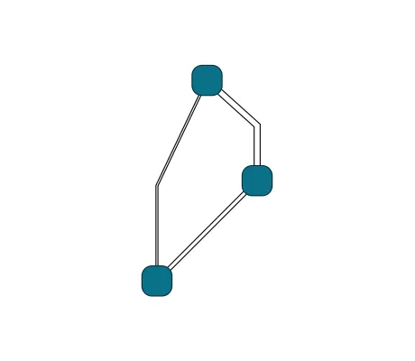

<!--
 //////////////////////////////////////////////////////////////////////////////
 // @license
 // This file is part of yFiles for HTML.
 // Use is subject to license terms.
 //
 // Copyright (c) by yWorks GmbH, Vor dem Kreuzberg 28,
 // 72070 Tuebingen, Germany. All rights reserved.
 //
 //////////////////////////////////////////////////////////////////////////////
-->
#

      05 Making the Style Configurable - Tutorial: Edge Style Implementation



[You can also run this demo online](https://www.yfiles.com/demos/tutorial-style-implementation-edge/05-making-the-style-configurable/).

Frequently, the visualized edges differ in visual properties like color, dash-style, or thickness, while looking generally the same. In this case, the style can define properties that let you configure certain details of the visualization while using the same edge style class.

In this example, we add a `distance` property to the style, that defines the gap between the parallel paths. For this purpose, we add a constructor-defined property without an explicit getter or setter.

```
constructor(distance = 1) {
  super()
  this.distance = distance
}
```

The property can now be used in `createVisual` to calculate and set the stroke width of the paths.

```
const distance = this.distance
widePath.setAttribute('stroke-width', String(distance + 2))
thinPath.setAttribute('stroke-width', String(distance))
```

Now, we can create edges with different distances. The distance can either be passed into the constructor or specified later using the `distance` property. The distance can also be changed dynamically during runtime.

```
// the distance can be specified in the constructor
const style1 = new CustomEdgeStyle(5)

// the distance can also be changed later using the property on the style class
const style2 = new CustomEdgeStyle(1)
style2.distance = 3

// not specifying the distance will use the default value
const style3 = new CustomEdgeStyle()
```

Furthermore, it is important to store the distance in the cache in `createVisual` and check in `updateVisual` whether its value has been changed in the meantime. And if so, you should update the `stroke-width` attribute of the paths.

```
if (this.distance !== cache.distance) {
  widePath.setAttribute('stroke-width', String(this.distance + 2))
  thinPath.setAttribute('stroke-width', String(this.distance))
  cache.distance = this.distance
}
```

Note

All edges that share the same style instance will be rendered with the same distance. Thus, changing the distance of one edge’s style will also affect the distance of all other edges that share the same style instance.

[06 Data from Tag](../../tutorial-style-implementation-edge/06-data-from-tag/)
