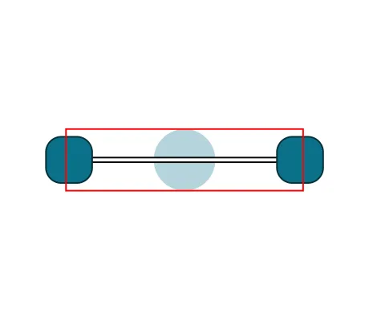

<!--
 //////////////////////////////////////////////////////////////////////////////
 // @license
 // This file is part of yFiles for HTML.
 // Use is subject to license terms.
 //
 // Copyright (c) by yWorks GmbH, Vor dem Kreuzberg 28,
 // 72070 Tuebingen, Germany. All rights reserved.
 //
 //////////////////////////////////////////////////////////////////////////////
-->
# 09 Render Boundaries - Tutorial: Edge Style Implementation



[You can also run this demo online](https://www.yworks.com/demos/tutorial-style-implementation-edge/09-bounds/).

Some functions of yFiles for HTML require the exact boundaries of the edge visualization. This includes fitting the whole graph into the viewport, enabling scrollbars, or just figuring out how large an exported image should be.

In most cases, the edge path suffices, but some styles may extend past their edge boundaries. Again, we add a circle to the edge, which lies partly outside the edge path. The red rectangle around the edge below highlights the default visualization boundaries of the edge. As you can see, the badge exceeds the boundaries.

To include the badge in the boundaries, we have to override `getBounds` and enlarge the bounds accordingly.

```
protected getBounds(context: ICanvasContext, edge: IEdge): Rect {
  const path = super.getPath(edge)!
  const thickness = this.distance + 2

  const edgeBounds = path.getBounds().getEnlarged(thickness * 0.5)

  const circleBounds = Rect.fromCenter(
    path.getPoint(0.5),
    new Size(circleRadius * 2, circleRadius * 2)
  )

  return Rect.add(edgeBounds, circleBounds)
}
```

[10 Bridge Support](../../tutorial-style-implementation-edge/10-bridge-support/)
