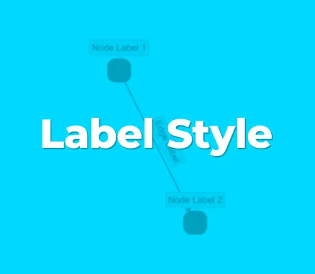

<!--
 //////////////////////////////////////////////////////////////////////////////
 // @license
 // This file is part of yFiles for HTML.
 // Use is subject to license terms.
 //
 // Copyright (c) by yWorks GmbH, Vor dem Kreuzberg 28,
 // 72070 Tuebingen, Germany. All rights reserved.
 //
 //////////////////////////////////////////////////////////////////////////////
-->
#

      01 Rendering the Label Text - Tutorial: Label Style Implementation



[You can also run this demo online](https://www.yfiles.com/demos/tutorial-style-implementation-label/01-render-label-text/).

yFiles for HTML comes with predefined item visualizations and lots of different shapes for labels. However, in some cases, it is required to create fully custom visualizations based on SVG. This might be the case if you need shapes that are not available out-of-the-box or domain-specific label visualizations. Also, the rendering of custom visualizations can be optimized for performance-critical applications.

This tutorial will guide you through creating your own label visualizations for yFiles for HTML with SVG.

Note

Implementing a custom label style from scratch is an advanced concept. In a lot of cases, other approaches like template styles or decorating built-in styles with custom elements are enough. For more information on the topic of styling graph items, please have a look at [Label Styles](https://docs.yworks.com/yfileshtml/#/dguide/styles-label_styles).

## Subclassing LabelStyleBase

yFiles for HTML provides an abstract base class which provides the basic functionality to create a custom label style. We start with a custom subclass of [LabelStyleBase](https://docs.yworks.com/yfileshtml/#/api/LabelStyleBase).

```
export class CustomLabelStyle extends LabelStyleBase {
  protected createVisual(
    context: IRenderContext,
    label: ILabel
  ): Visual | null {
    return null // TODO - create the SVG element
  }

  protected getPreferredSize(label: ILabel): Size {
    return new Size(50, 20) // TODO - calculate the size
  }
}
```

This code will not produce anything visible, yet. We first have to implement the `createVisual` method. This method returns an SVG element, wrapped into an [SvgVisual](https://docs.yworks.com/yfileshtml/#/api/SvgVisual). Let’s start with only a text for now to keep things simple. We will switch to a more complex visualization later on.

```
protected createVisual(
  context: IRenderContext,
  label: ILabel
): Visual | null {
  // create an SVG text element that displays the label text
  const textElement = document.createElementNS(
    'http://www.w3.org/2000/svg',
    'text'
  )
  textElement.textContent = label.text

  // move text to label location
  const transform = LabelStyleBase.createLayoutTransform(
    context,
    label.layout,
    true
  )
  transform.applyTo(textElement)

  // move the text down by the label height
  textElement.setAttribute('dy', String(label.layout.height))

  return new SvgVisual(textElement)
}
```

Note

The SVG element returned in `createVisual` does not necessarily have to be created using the JavaScript DOM API. You could also create it using any JavaScript UI framework or API like React, Vue, etc.

As you can see in the sample graph, the label style works for both, node and edge labels. It also supports rotation without any further adjustment. This is handled by the layout transform that is created and assigned in the following two lines. The last parameter in `createLayoutTransform` specifies whether the label should be flipped if it is upside-down.

```
const transform = LabelStyleBase.createLayoutTransform(
  context,
  label.layout,
  true
)
transform.applyTo(textElement)
```

Since the SVG text anchor point is bottom-left and the label layout anchor point is top-left, we have to manually set the 'dy' attribute of the text to move it down by one label height, or else the text would be placed above the actual label layout.

```
textElement.setAttribute('dy', String(label.layout.height))
```

[02 Using Text Utilities](../../tutorial-style-implementation-label/02-using-text-utilities/)
