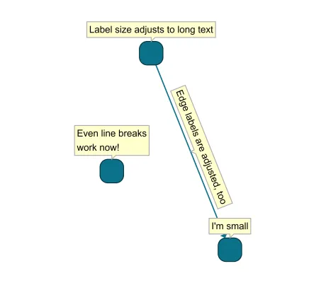

<!--
 //////////////////////////////////////////////////////////////////////////////
 // @license
 // This file is part of yFiles for HTML.
 // Use is subject to license terms.
 //
 // Copyright (c) by yWorks GmbH, Vor dem Kreuzberg 28,
 // 72070 Tuebingen, Germany. All rights reserved.
 //
 //////////////////////////////////////////////////////////////////////////////
-->
# 04 Preferred Label Size - Tutorial: Label Style Implementation



[You can also run this demo online](https://www.yfiles.com/demos/tutorial-style-implementation-label/04-preferred-size/).

[LabelStyleBase](https://docs.yworks.com/yfileshtml/#/api/LabelStyleBase) provides the abstract method [getPreferredSize](https://docs.yworks.com/yfileshtml/#/api/LabelStyleBase#LabelStyleBase-method-getPreferredSize) that needs to be implemented to tell the framework how large the label prefers to be.

Until now, the label style implementation has returned a fixed preferred size. This means that the label size is not adjusted to shorter or longer texts. Also, the label wouldn’t grow in height if the text contains a line break.

We adjust the implementation of [getPreferredSize](https://docs.yworks.com/yfileshtml/#/api/LabelStyleBase#LabelStyleBase-method-getPreferredSize) to measure the label text and return the measured size. [TextRenderSupport.measureText](https://docs.yworks.com/yfileshtml/#/api/TextRenderSupport#TextRenderSupport-method-measureText) helps us to get the desired size. We add a small padding of 3 for each side.

```
protected getPreferredSize(label: ILabel): Size {
  // measure the label text using the font
  const { width, height } = TextRenderSupport.measureText(label.text, font)
  // return the measured size plus a small padding
  return new Size(width + padding + padding, height + padding + padding)
}
```

To see the labels adjust to different text lengths, select a node or edge and press F2 to edit the label. Press Ctrl+Enter to insert a line break.

We also adjust the translate transform of the text element in `createVisual` to consider the padding vertically.

```
textElement.setAttribute('transform', `translate(${padding} ${padding})`)
```

Note

The [ILabelModel](https://docs.yworks.com/yfileshtml/#/api/ILabelModel) may or may not take the preferred size into account. Therefore, it is not guaranteed that the label will become as large as the preferred size. Most label models, like [ExteriorLabelModel](https://docs.yworks.com/yfileshtml/#/api/ExteriorLabelModel), [InteriorLabelModel](https://docs.yworks.com/yfileshtml/#/api/InteriorLabelModel), [FreeLabelModel](https://docs.yworks.com/yfileshtml/#/api/FreeLabelModel) etc. will respect the value, though. Usually, only stretch label models like [InteriorStretchLabelModel](https://docs.yworks.com/yfileshtml/#/api/InteriorStretchLabelModel), that fit the content into the owner node, will result in a different size.

[05 Render Performance](../../tutorial-style-implementation-label/05-render-performance/)
