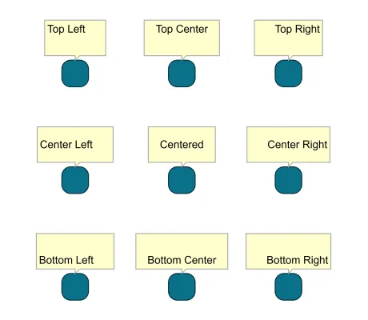

<!--
 //////////////////////////////////////////////////////////////////////////////
 // @license
 // This file is part of yFiles for HTML.
 // Use is subject to license terms.
 //
 // Copyright (c) by yWorks GmbH, Vor dem Kreuzberg 28,
 // 72070 Tuebingen, Germany. All rights reserved.
 //
 //////////////////////////////////////////////////////////////////////////////
-->
# 06 Text Alignment - Tutorial: Label Style Implementation



[You can also run this demo online](https://www.yfiles.com/demos/tutorial-style-implementation-label/06-text-alignment/).

In this step, we will add horizontal and vertical text alignment support to the label style.

First, we add a constructor with properties for both options.

```
constructor(
  public horizontalAlignment: 'start' | 'middle' | 'end' = 'middle',
  public verticalAlignment: 'top' | 'center' | 'bottom' = 'center'
) {
  super()
}
```

We’ll introduce an `updateText` method that updates the text element’s text content and alignment and can be used in `createVisual` and `updateVisual`.

```
private updateText(
  textElement: SVGTextElement,
  text: string,
  labelSize: Size
): void {
```

To horizontally align the text, we use the SVG [text-anchor](https://developer.mozilla.org/docs/Web/SVG/Attribute/text-anchor) property. After setting the anchor point of the text, we set the x-value of the translation according to the left, middle or right position of the label layout. This way, we don’t have to measure the text.

```
textElement.setAttribute('text-anchor', this.horizontalAlignment)

// calculate offset for horizontal alignment
// leave room for the padding
let translateX: number
switch (this.horizontalAlignment) {
  case 'start':
    // the left border of the label
    translateX = padding
    break
  case 'middle':
    // the label center
    translateX = labelSize.width * 0.5
    break
  case 'end':
    // the right border of the label
    translateX = labelSize.width - padding
    break
}
```

Next, we will vertically align the text. Since SVG `<text>` does not support a vertical anchor point, we have to use the measured height to calculate the vertical offset.

```
// calculate the size of the text element
const textSize = TextRenderSupport.measureText(textContent, font)

// calculate vertical offset for centered alignment
let translateY: number = (labelSize.height - textSize.height) * 0.5
switch (this.verticalAlignment) {
  case 'top':
    translateY = padding
    break
  case 'center':
    translateY = (labelSize.height - textSize.height) * 0.5
    break
  case 'bottom':
    translateY = labelSize.height - textSize.height - padding
    break
}
```

Note

Measuring text can be very costly, especially if a lot of text elements have to be measured frequently. Therefore, it should be used as little as possible. In this style, the text is only measured if the label size or text, or the alignment changes.

[07 Line Wrapping](../../tutorial-style-implementation-label/07-line-wrapping/)
