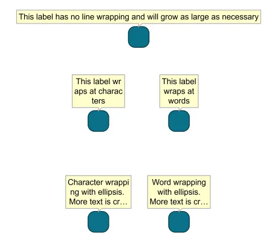

<!--
 //////////////////////////////////////////////////////////////////////////////
 // @license
 // This file is part of yFiles for HTML.
 // Use is subject to license terms.
 //
 // Copyright (c) by yWorks GmbH, Vor dem Kreuzberg 28,
 // 72070 Tuebingen, Germany. All rights reserved.
 //
 //////////////////////////////////////////////////////////////////////////////
-->
# 07 Line Wrapping - Tutorial: Label Style Implementation



[You can also run this demo online](https://www.yfiles.com/demos/tutorial-style-implementation-label/07-line-wrapping/).

So far, the label text was placed in a single line unless it contained manual line breaks. In this step, we’ll introduce automatic line wrapping to our label style. Since SVG `<text>` does not support line wrapping out-of-the-box, [TextRenderSupport](https://docs.yworks.com/yfileshtml/#/api/TextRenderSupport) provides functionality for this purpose. The enum [TextWrapping](https://docs.yworks.com/yfileshtml/#/api/TextWrapping) can be used to specify different wrapping policies like wrapping at character, or at word boundaries.

First, we define parameters for the line wrapping policy and the maximum size in the style’s constructor.

```
constructor(
  private wrapping: TextWrapping = TextWrapping.NONE,
  private maxSize: Size = Size.INFINITE
) {
  super()
}
```

Now, we can use these values in our rendering code. But first, we will adjust the preferred size calculation to respect the maximum size.

```
// subtract the padding from the maximum size for text measuring
const maxTextSize = new Size(
  this.maxSize.width - padding - padding,
  this.maxSize.height - padding - padding
)
// measure the label text using the maximum size and the wrapping
const { width, height } = TextRenderSupport.measureText(
  label.text,
  font,
  maxTextSize,
  this.wrapping
)
// add the padding to the measured text size again
return new Size(width + padding + padding, height + padding + padding)
```

Finally, we can use the maximum size and line wrapping policy in [TextRenderSupport.addText](https://docs.yworks.com/yfileshtml/#/api/TextRenderSupport#TextRenderSupport-method-addText).

```
// subtract the padding from the maximum size for text measuring
const maxTextSize = new Size(
  this.maxSize.width - padding - padding,
  this.maxSize.height - padding - padding
)
const textContent = TextRenderSupport.addText(
  textElement,
  text,
  font,
  maxTextSize,
  this.wrapping
)
```

In the sample graph, you can see the different options for line wrapping. Edit the labels using F2 to see how the wrapping behaves.

[08 Data From Tag](../../tutorial-style-implementation-label/08-data-from-tag/)
