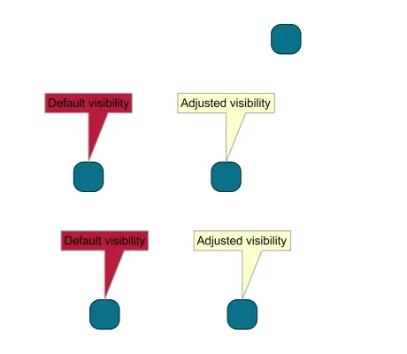

<!--
 //////////////////////////////////////////////////////////////////////////////
 // @license
 // This file is part of yFiles for HTML.
 // Use is subject to license terms.
 //
 // Copyright (c) 2026 by yWorks GmbH, Vor dem Kreuzberg 28,
 // 72070 Tuebingen, Germany. All rights reserved.
 //
 //////////////////////////////////////////////////////////////////////////////
-->
# 10 Visibility - Tutorial: Label Style Implementation



[You can also run this demo online](https://www.yfiles.com/demos/tutorial-style-implementation-label/10-visibility/).

yFiles for HTML will only render items that are considered visible in the viewport. Hence, performance usually only depends on the number of items that are in the visible part of the graph.

If the label visualization exceeds the label layout, it is considered invisible, even if the overflowing part of the visualization is in the viewport. yFiles for HTML will cause the item to disappear prematurely as it nears the borders of the viewport.

To make this more evident, the "tail" of the speech balloon has been made larger in this sample. Observe the animation of the red labels, which flicker when they reach the top border of the viewport. To prevent this, we have to implement [isVisible](https://docs.yworks.com/yfileshtml/api/LabelStyleBase#isVisible). The yellow labels use an adjusted style and leave/enter the viewport smoothly.

```
protected isVisible(
  context: ICanvasContext,
  rectangle: Rect,
  label: ILabel
): boolean {
  // check the label layout first
  const labelLayout = label.layout
  if (rectangle.intersects(labelLayout)) {
    return true
  }
  // check the tail area
  const tailArea = this.getTailArea(labelLayout)
  return rectangle.intersects(tailArea)
}
```

In order to check the tail for visibility, we have to create an [IOrientedRectangle](https://docs.yworks.com/yfileshtml/api/IOrientedRectangle) that contains the tail triangle.

```
private getTailArea(labelLayout: IOrientedRectangle): IOrientedRectangle {
  const w = labelLayout.width * 0.5
  const h = -tailHeight
  // calculate the tip point of the tail triangle
  const tailTipX =
    labelLayout.anchorX + labelLayout.upX * h - labelLayout.upY * w
  const tailTipY =
    labelLayout.anchorY + labelLayout.upY * h + labelLayout.upX * w
  return new OrientedRectangle({
    anchorX: tailTipX,
    anchorY: tailTipY,
    height: tailHeight,
    width: tailWidth,
    upX: labelLayout.upX,
    upY: labelLayout.upY
  })
}
```

Implementations for [isVisible](https://docs.yworks.com/yfileshtml/api/LabelStyleBase#isVisible) often delegate to [getBounds](https://docs.yworks.com/yfileshtml/api/LabelStyleBase#getBounds) since both concepts are related in that they act on the visible boundaries of the item.

Note

Since [isVisible](https://docs.yworks.com/yfileshtml/api/LabelStyleBase#isVisible) is called once for each item on every rendered frame, the implementation should be fast, even if this means to be inexact. If in doubt, prefer making the item visible. In this sample, we check the complete rectangular tail area, instead of making an exact check for the triangle.

[11 Bounds](../../tutorial-style-implementation-label/11-bounds/)
