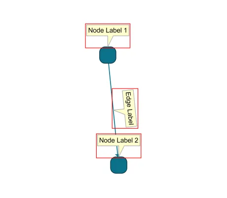

<!--
 //////////////////////////////////////////////////////////////////////////////
 // @license
 // This file is part of yFiles for HTML.
 // Use is subject to license terms.
 //
 // Copyright (c) by yWorks GmbH, Vor dem Kreuzberg 28,
 // 72070 Tuebingen, Germany. All rights reserved.
 //
 //////////////////////////////////////////////////////////////////////////////
-->
# 11 Bounds - Tutorial: Label Style Implementation



[You can also run this demo online](https://www.yfiles.com/demos/tutorial-style-implementation-label/11-bounds/).

Some functions of yFiles for HTML require the exact boundaries of the label visualization. This includes fitting the whole graph into the viewport, enabling scrollbars, or just figuring out how large an exported image should be.

In most cases, the label layout suffices, but some styles may extend past their node boundaries. In our case, the speech balloon "tail" exceeds the label layout. The red rectangle around the labels below highlights the default visualization boundaries of the labels. As you can see, the tail exceeds the boundaries.

To include the "tail" in the boundaries, we have to override `getBounds` and enlarge the bounds accordingly. We use the same method `getTailArea` to calculate the tail area [IOrientedRectangle](https://docs.yworks.com/yfileshtml/#/api/IOrientedRectangle).

```
protected getBounds(context: ICanvasContext, label: ILabel): Rect {
  const labelLayout = label.layout
  // calculate the tail area
  const tailArea = this.getTailArea(labelLayout)
  // return the union of the label layout and tail bounds
  return Rect.add(labelLayout.bounds, tailArea.bounds)
}
```
