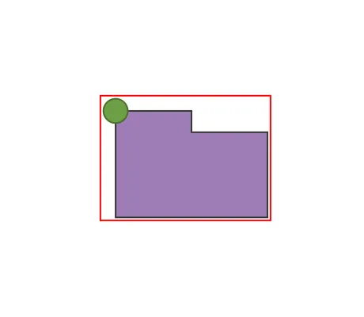

<!--
 //////////////////////////////////////////////////////////////////////////////
 // @license
 // This file is part of yFiles for HTML.
 // Use is subject to license terms.
 //
 // Copyright (c) 2026 by yWorks GmbH, Vor dem Kreuzberg 28,
 // 72070 Tuebingen, Germany. All rights reserved.
 //
 //////////////////////////////////////////////////////////////////////////////
-->
# 10 Render Boundaries - Tutorial: Node Style Implementation



[You can also run this demo online](https://www.yfiles.com/demos/tutorial-style-implementation-node/10-bounds/).

Some functions of yFiles for HTML require the exact boundaries of the node visualization. This includes fitting the whole graph into the viewport, enabling scrollbars, or just figuring out how large an exported image should be.

In most cases, the node layout suffices, but some styles may extend past their node boundaries. Remember the badge we have shown earlier, which lies partly outside the original node layout. The red rectangle around the node below highlights the default visualization boundaries of the node. As you can see, the badge exceeds the boundaries.

To include the badge in the boundaries, we have to override [getBounds](https://docs.yworks.com/yfileshtml/api/NodeStyleBase#getBounds) and enlarge the bounds accordingly, if the badge is rendered.

```
protected getBounds(context: ICanvasContext, node: INode): Rect {
  const { tag } = node
  // Do we even have a badge?
  if (tag?.showBadge) {
    // If so, return a rectangle that's larger to the left and top
    return node.layout
      .toRect()
      .getEnlarged({ left: badgeRadius, top: badgeRadius })
  }
  return node.layout.toRect()
}
```

[11 Group Node Style](../../tutorial-style-implementation-node/11-group-node-style/)
