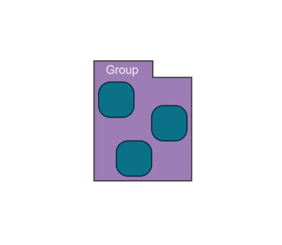

<!--
 //////////////////////////////////////////////////////////////////////////////
 // @license
 // This file is part of yFiles for HTML.
 // Use is subject to license terms.
 //
 // Copyright (c) by yWorks GmbH, Vor dem Kreuzberg 28,
 // 72070 Tuebingen, Germany. All rights reserved.
 //
 //////////////////////////////////////////////////////////////////////////////
-->
# 11 Group Node Style - Tutorial: Node Style Implementation



[You can also run this demo online](https://www.yfiles.com/demos/tutorial-style-implementation-node/11-group-node-style/).

Now that we’ve learned how to write a style for nodes, we will apply this knowledge to group nodes. The good thing about group node styles is that they work exactly the same way as other node styles. This means that we could use our style for group nodes without changing anything.

As you can see, child nodes are placed inside the tab area of this style. To prevent this, we can define a specific padding for the group by implementing the interface [IGroupPaddingProvider](https://docs.yworks.com/yfileshtml/#/api/IGroupPaddingProvider). We use the [lookup](https://docs.yworks.com/yfileshtml/#/dguide/customizing_concepts_lookup) mechanism to provide a padding that considers the tab height for this style.

```
protected lookup(node: INode, type: Constructor<any>): any {
  if (type === IGroupPaddingProvider) {
    // use a custom padding provider that reserves space for the tab
    return IGroupPaddingProvider.create(
      () => new Insets(tabHeight + 4, 4, 4, 4)
    )
  }
  return super.lookup(node, type)
}
```

[12 Group Node Style Behavior](../../tutorial-style-implementation-node/12-group-node-style-behavior/)
