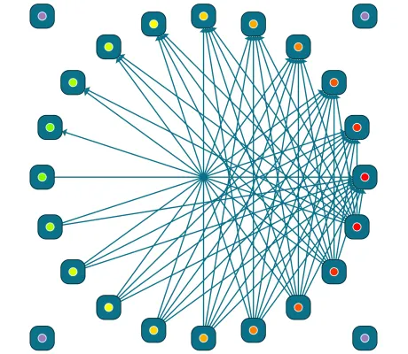

<!--
 //////////////////////////////////////////////////////////////////////////////
 // @license
 // This file is part of yFiles for HTML.
 // Use is subject to license terms.
 //
 // Copyright (c) by yWorks GmbH, Vor dem Kreuzberg 28,
 // 72070 Tuebingen, Germany. All rights reserved.
 //
 //////////////////////////////////////////////////////////////////////////////
-->
#

      04 Conditional Port Coloring - Tutorial: Port Style Implementation



[You can also run this demo online](https://www.yworks.com/demos/tutorial-style-implementation-port/04-conditional-coloring/).

In this example, we will fill the port shape with a color that is determined by the number of connected edges. Ports with no connections will be filled green, ports with 10 or more connections will be filled red. Values between 0 and 10 will result in the hue blended between green and red. Alternatively, the color from the port’s tag is used, if defined.

We introduce two methods that get the port color from the tag, or calculate the hue based on the port’s degree. For this purpose, we get the [graph](https://docs.yworks.com/yfileshtml/#/api/IGraph) from the [render context](https://docs.yworks.com/yfileshtml/#/api/IRenderContext).

```
private getColor(graph: IGraph, port: IPort): string {
  return port.tag?.color ?? this.calculateColorByDegree(graph, port)
}
```

```
private calculateColorByDegree(graph: IGraph, port: IPort): string {
  // get the number of edges connected to the port
  const portDegree = graph.degree(port)
  const ratio = Math.min(portDegree / 10, 1)
  const hue = (1 - ratio) * 100
  return `hsl(${hue}deg 100% 50%)`
}
```

Now, we can assign the color to the ellipse element in `createVisual`.

```
const color = this.getColor(graph, port)
ellipseElement.setAttribute('fill', color)
```

Note

Remove or create edges to observe how the color of the port changes dynamically. The nodes in the corners have the color defined in the tag and therefore do not change dynamically.

The color also has to be considered in `updateVisual`. We add the color in the cache and update the `fill` property if the color has changed.

```
// get the graph from the render context
const graph = (context.canvasComponent as GraphComponent).graph
const color = this.getColor(graph, port)
if (cache.color !== color) {
  ellipseElement.setAttribute('fill', color)
  cache.color = color
}
```

Note

You can also use business data that’s stored in the port’s [tag](https://docs.yworks.com/yfileshtml/#/api/IPort#ITagOwner-property-tag) for conditional styling. This way, a single style instance that’s shared between all ports can produce varying visualizations.

[05 Hit-Testing](../../tutorial-style-implementation-port/05-hit-testing/)
