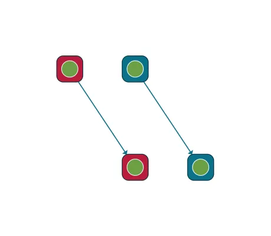

<!--
 //////////////////////////////////////////////////////////////////////////////
 // @license
 // This file is part of yFiles for HTML.
 // Use is subject to license terms.
 //
 // Copyright (c) 2026 by yWorks GmbH, Vor dem Kreuzberg 28,
 // 72070 Tuebingen, Germany. All rights reserved.
 //
 //////////////////////////////////////////////////////////////////////////////
-->
# 05 Hit-Testing - Tutorial: Port Style Implementation



[You can also run this demo online](https://www.yfiles.com/demos/tutorial-style-implementation-port/05-hit-testing/).

Styles not only provide a visual representation for graph items. They also offer crucial parts for interacting with said items. Hit-testing determines whether a particular item is at a given point in the canvas. It happens all the time during interaction, e.g., when selecting items, moving nodes, or creating edges.

The default implementation in the [PortStyleBase](https://docs.yworks.com/yfileshtml/api/PortStyleBase) class only considers the bounds returned by [getBounds](https://docs.yworks.com/yfileshtml/api/PortStyleBase#getBounds) when hit-testing. When ports have shapes that deviate from the rectangular bounds, hit-testing has to be adjusted by providing a different implementation for the [isHit](https://docs.yworks.com/yfileshtml/api/PortStyleBase#isHit) method.

In this example, we have to adjust the hit-test to the circular port shape. We also take the hit-test radius into account. This radius enables a bit of fuzziness when hit-testing the item, so you can still hit it when you’re slightly outside.

```
protected isHit(
  context: IInputModeContext,
  location: Point,
  port: IPort
): boolean {
  // get the ellipse bounds
  const bounds = this.getBounds(context, port)
  // use a convenience function to check if the location is inside the ellipse
  return GeometryUtilities.ellipseContains(
    bounds,
    location,
    context.hitTestRadius
  )
}
```

Note

Try this implementation by hovering the ports. Notice that the ports at the red node, which uses the default hit-test, also detect hits outside the visual circle within the bounds. The ports at the blue node use the adjusted hit-test code and detect the hover only in the circle.

[06 Edge Cropping](../../tutorial-style-implementation-port/06-edge-cropping/)
