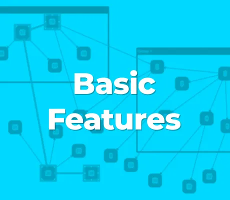

<!--
 //////////////////////////////////////////////////////////////////////////////
 // @license
 // This file is part of yFiles for HTML.
 // Use is subject to license terms.
 //
 // Copyright (c) 2026 by yWorks GmbH, Vor dem Kreuzberg 28,
 // 72070 Tuebingen, Germany. All rights reserved.
 //
 //////////////////////////////////////////////////////////////////////////////
-->
# 01 Creating the View - Tutorial: Basic Features



[You can also run this demo online](https://www.yfiles.com/demos/tutorial-yfiles-basic-features/01-graphcomponent/).

## How to create a basic view.

This step introduces class [GraphComponent](https://docs.yworks.com/yfileshtml/api/GraphComponent), which is the [central UI element for working with graphs](https://docs.yworks.com/yfileshtml/dguide/getting_started-application#getting_started-application). The app does not provide any interactive features except basic navigation and selection, which is enabled by default. It is merely meant as a very basic example of how to display a [GraphComponent](https://docs.yworks.com/yfileshtml/api/GraphComponent) within a web page.

This is the minimal code that’s needed to display a graph on a web page using yFiles for HTML.

First we make sure that there is a `div` element on the HTML page in the document. It will host the graph component visualization.

```
<div id="graphComponent"></div>
```

We should also make sure that the `div` actually has a reasonable size, as the default style will only set a `min-width` and `min-height` to `100px`. We can do this via CSS, but any technique that assigns a positive size to the element would work:

```
#graphComponent {
  width: 100%;
  height: 100%;
  background-color: white;
}
```

Now, in the code we can initialize the [GraphComponent](https://docs.yworks.com/yfileshtml/api/GraphComponent) and wire it up with the existing `div`.

```
// create a new graph component in the div element specified via the CSS selector
const graphComponent = new GraphComponent('#graphComponent')
```

And just to make this a little less boring and so that we can see something in the view, we add a node with a label and center it in the view. This, of course, is purely optional.

```
// create a single node as an example
const node = graphComponent.graph.createNode()
// and add a label
graphComponent.graph.addLabel(node, 'y')
// then center the graph in the component
await graphComponent.fitGraphBounds()
```

Note

The yFiles demo and tutorial applications use additional scripts and CSS (demo-ui) to reduce the amount of boilerplate code that is needed to get a good-looking demo app that shows the relevant features. All code samples included in this distribution can be implemented using plain HTML and TypeScript/JavaScript together with yFiles for HTML.

For a minimal example of using yFiles for HTML to display a graph on a web page, please take a look at the [Basic Demo Demo](../../loading/basic-demo/).

## App Generator

Alternatively, you may use the [App Generator](https://www.yworks.com/products/app-generator) to create visualization prototypes – quickly and easily. It will allow you to scaffold a working code example using your preferred UI framework (React, Vue, Angular, Plain, etc.)

[02 Creating Graph Elements](../../tutorial-yfiles-basic-features/02-graph-element-creation/)
