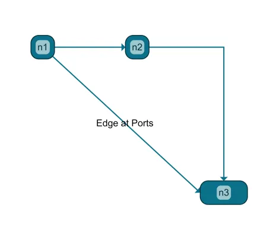

<!--
 //////////////////////////////////////////////////////////////////////////////
 // @license
 // This file is part of yFiles for HTML.
 // Use is subject to license terms.
 //
 // Copyright (c) by yWorks GmbH, Vor dem Kreuzberg 28,
 // 72070 Tuebingen, Germany. All rights reserved.
 //
 //////////////////////////////////////////////////////////////////////////////
-->
# 02 Creating Graph Elements - Tutorial: Basic Features



[You can also run this demo online](https://www.yfiles.com/demos/tutorial-yfiles-basic-features/02-graph-element-creation/).

## How to create a graph programmatically

This step shows how to [create the basic graph elements](https://docs.yworks.com/yfileshtml/#/dguide/getting_started-application#getting_started-creating_graph_elements) using the core [IGraph](https://docs.yworks.com/yfileshtml/#/api/IGraph). Note that depending on your specific use-case, you will let the user create the elements, interactively, or you might be using [GraphBuilder](https://docs.yworks.com/yfileshtml/#/api/GraphBuilder) to populate your graph. The latter is covered in the **[Graph Builder Tutorial](../../README.html#tutorial-graph-builder)**. Also consider using the **[App Generator](https://www.yworks.com/app-generator)** which can help you load your graphs from a convenient low-code interface.

In this example, we use the low-level [IGraph](https://docs.yworks.com/yfileshtml/#/api/IGraph) to first create the nodes. The size is determined by [the default size](https://docs.yworks.com/yfileshtml/#/api/INodeDefaults#size).

```
const node1 = graph.createNode()
const node2 = graph.createNodeAt(new Point(150, 15))
```

The third node is created by specifying the node layout. We use a size of `[60,30]`. In this case, the X/Y location describes the upper left corner of the node bounds.

```
const node3 = graph.createNode(new Rect(230, 200, 60, 30))
```

Now, let us add some edges to connect the nodes.

```
graph.createEdge(node1, node2)
const edgeWithBend = graph.createEdge(node2, node3)
```

We add a bend to the second edge.

```
graph.addBend(edgeWithBend, new Point(260, 15))
```

Next, we add two ports to the nodes and connect the ports using an edge.

Note

Edges always start and end at ports. In the above example, where we only specified the nodes, the ports are created implicitly.

```
// Create a port in the center of the node layout
const port1AtNode1 = graph.addPort(node1, FreeNodePortLocationModel.CENTER)

// Create a port at the middle of the left border
// The location is interpreted as absolute coordinates
const port1AtNode3 = graph.addPortAt(
  node3,
  new Point(node3.layout.x, node3.layout.center.y)
)

// Create an edge that connects the two ports
const edgeAtPorts = graph.createEdge(port1AtNode1, port1AtNode3)
```

Finally, add labels to the graph items we just created.

```
graph.addLabel(node1, 'n1')
graph.addLabel(node2, 'n2')
graph.addLabel(node3, 'n3')
graph.addLabel(edgeAtPorts, 'Edge at Ports')
```

[03 Managing Viewport](../../tutorial-yfiles-basic-features/03-managing-viewport/)
