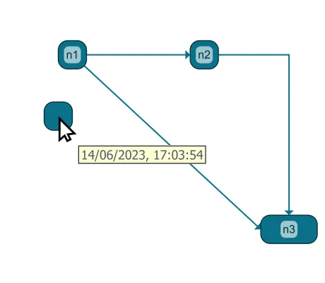

<!--
 //////////////////////////////////////////////////////////////////////////////
 // @license
 // This file is part of yFiles for HTML.
 // Use is subject to license terms.
 //
 // Copyright (c) by yWorks GmbH, Vor dem Kreuzberg 28,
 // 72070 Tuebingen, Germany. All rights reserved.
 //
 //////////////////////////////////////////////////////////////////////////////
-->
# 09 Data Binding - Tutorial: Basic Features



[You can also run this demo online](https://www.yworks.com/demos/tutorial-yfiles-basic-features/09-data-binding/).

## How to bind arbitrary data to elements.

This step shows how to [bind data to graph elements](https://docs.yworks.com/yfileshtml/#/dguide/customizing_graph-binding_data).

Business data can be stored conveniently in the [tag](https://docs.yworks.com/yfileshtml/#/api/IModelItem#ITagOwner-property-tag) of a graph item. In this example, we store the creation date with each node as follows:

```
// Store the current time as node creation time
graph.createNode({ layout: new Rect(0, 80, 30, 30), tag: new Date() })
```

- Hover a node to show a tooltip with the date.
- Update the date stored with a node using the context menu.

To dynamically update/store the creation date in the tag, we add a node creation listener to the graph. The listener adds the tag if no tag has been specified at creation time.

```
graph.addEventListener('node-created', (evt): void => {
  // Store the current time as node creation time
  const node = evt.item
  // if there is no tag associated with the node, already, add one
  if (node.tag === null) {
    node.tag = new Date()
  }
})
```

It is rather uncommon to modify data whenever an item gets created in response to the low-level creation events. This is because the same events get triggered upon undo/redo, during loading, clipboard operations, etc.

Instead, likely you want to store the tag with the element when the user creates the item. If we only want to handle events caused by interactive node creation, we could register to the node creation event of the input mode.

```
graphEditorInputMode.addEventListener('node-created', (evt): void => {
  // Store the current time as node creation time
  const node = evt.item
  node.tag = new Date()
})
```

Once we have data stored in the `tag`, it is conveniently available in all parts of the API.

E.g., now we can get the data from the tag to display in the tooltip. In the event handler that handles tooltips, this works like this:

```
// Set the tooltip content
evt.toolTip =
  'Created: ' +
  (node.tag instanceof Date
    ? new Intl.RelativeTimeFormat().format(
        node.tag.getTime() - new Date().getTime(),
        'seconds'
      )
    : 'Who knows?')
```

Note

Since this demo focuses on storing the data, the tooltip and context menu code is not explained in detail. See the application-features-tooltips and the [Context Menu Demo](../../input/contextmenu/) for more information.

[10 Layout](../../tutorial-yfiles-basic-features/10-layout/)
