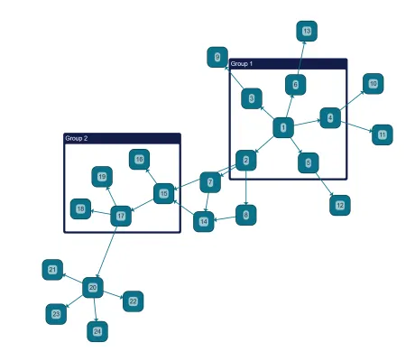

<!--
 //////////////////////////////////////////////////////////////////////////////
 // @license
 // This file is part of yFiles for HTML.
 // Use is subject to license terms.
 //
 // Copyright (c) by yWorks GmbH, Vor dem Kreuzberg 28,
 // 72070 Tuebingen, Germany. All rights reserved.
 //
 //////////////////////////////////////////////////////////////////////////////
-->
# 10 Layout - Tutorial: Basic Features



[You can also run this demo online](https://www.yworks.com/demos/tutorial-yfiles-basic-features/10-layout/).

## How to arrange the graph automatically

This step shows how to use the [layout algorithms](https://docs.yworks.com/yfileshtml/#/dguide/getting_started-application#getting_started-layout) in yFiles for HTML to automatically place the graph elements.

Automatic layout is one of the main features of the yFiles products. The layout library provides a large set of ready-to-use, highly customizable algorithms for most scenarios. The purpose of this sample is to demonstrate how to run an arbitrary layout algorithm. For an overview of the available layout styles, please see the [Layout Styles Demo](../../showcase/layoutstyles/).

### Calculating a layout

Click the button below to calculate and apply an automatic layout. In this example, the layout is not animated, but applied instantly.

Apply Hierarchical Layout

```
const layout = new HierarchicalLayout()
graph.applyLayout(layout)

// Fit the graph bounds since they changed for the new layout
graphComponent.fitGraphBounds()
```

### Running a layout animation

An automatic layout can also be applied with an animation. In this sample, we use [applyLayoutAnimated](https://docs.yworks.com/yfileshtml/#/api/GraphComponent#GraphComponent-defaultmethod-applyLayoutAnimated) to perform the layout, animate it, manage undo and adjust the content rectangle in one call. [applyLayoutAnimated](https://docs.yworks.com/yfileshtml/#/api/GraphComponent#GraphComponent-defaultmethod-applyLayoutAnimated) runs asynchronously and returns immediately yielding a Promise that we can await or use to catch errors.

Animate Organic Layout

```
// Ensure that the LayoutExecutor class is not removed by build optimizers
// It is needed for the 'applyLayoutAnimated' method in this demo.
LayoutExecutor.ensure() // doing this somewhere in your code should suffice

await graphComponent.applyLayoutAnimated({
  layout: new OrganicLayout(),
  animationDuration: '1s'
})
```

Note

applyLayoutAnimated is a convenience method that comes with a lot of parameters that can be used to adjust various aspects of the layout animation. For more customized scenarios, use class [LayoutExecutor](https://docs.yworks.com/yfileshtml/#/api/LayoutExecutor).

[11 Layout Data](../../tutorial-yfiles-basic-features/11-layout-data/)
