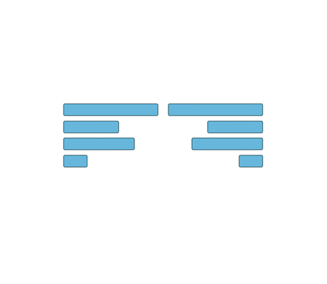

# Arrange Objects Demo

[You can also run this demo online](https://live.yworks.com/demos/view/arrange-objects/index.html).

This demo presents simple operations for aligning and distributing nodes.

## Things to Try

- Select several nodes and use  
          
  to align these nodes at their top, bottom, left, or right border.
- Select several nodes and use  
      
  to align these nodes such that their centers coincide.
- Select several horizontally and/or vertically overlapping nodes and use  
      
  to distribute these nodes along the indicated coordinate axis.
