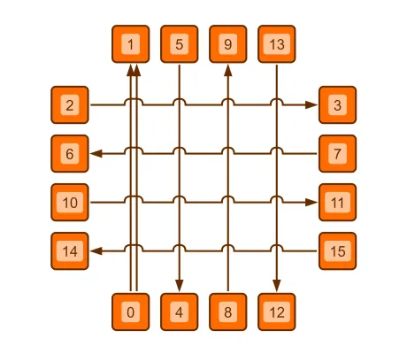

<!--
 //////////////////////////////////////////////////////////////////////////////
 // @license
 // This file is part of yFiles for HTML.
 // Use is subject to license terms.
 //
 // Copyright (c) by yWorks GmbH, Vor dem Kreuzberg 28,
 // 72070 Tuebingen, Germany. All rights reserved.
 //
 //////////////////////////////////////////////////////////////////////////////
-->
# Bridges Demo

[You can also run this demo online](https://www.yfiles.com/demos/view/bridges/).

The Bridges demo showcases the capabilities of the [BridgeManager](https://docs.yworks.com/yfileshtml/#/api/BridgeManager) class for inserting bridges into edge paths.

In addition to bridges for edge-edge intersections, this demo shows bridges for other obstacles like group node boundaries as well.

## Things to Try

- Create new edges and move existing nodes and bends to create new bridges.
- Explore the settings of the [BridgeManager](https://docs.yworks.com/yfileshtml/#/api/BridgeManager) using the toolbar's combo boxes.
