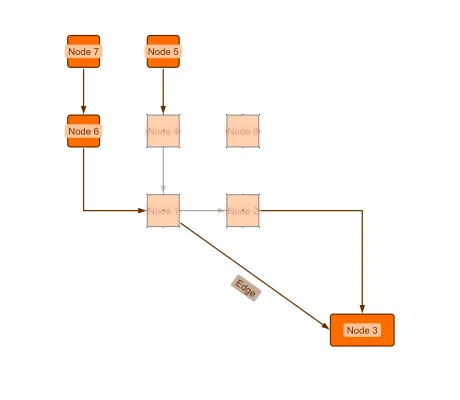

<!--
 //////////////////////////////////////////////////////////////////////////////
 // @license
 // This file is part of yFiles for HTML.
 // Use is subject to license terms.
 //
 // Copyright (c) by yWorks GmbH, Vor dem Kreuzberg 28,
 // 72070 Tuebingen, Germany. All rights reserved.
 //
 //////////////////////////////////////////////////////////////////////////////
-->
# Deferred Cut Clipboard Demo

[You can also run this demo online](https://www.yworks.com/demos/view/clipboard-deferred-cut/).

This demos shows how to implement a clipboard that grays out elements when they are cut and only removes them completely when they are pasted.

This behavior is similar to that of Windows Explorer.
