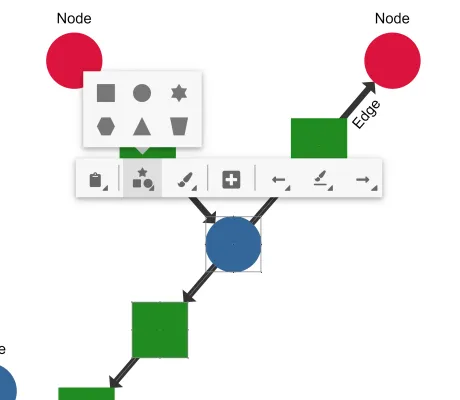

<!--
 //////////////////////////////////////////////////////////////////////////////
 // @license
 // This file is part of yFiles for HTML.
 // Use is subject to license terms.
 //
 // Copyright (c) by yWorks GmbH, Vor dem Kreuzberg 28,
 // 72070 Tuebingen, Germany. All rights reserved.
 //
 //////////////////////////////////////////////////////////////////////////////
-->
# Contextual Toolbar

[You can also run this demo online](https://www.yworks.com/demos/view/contextualtoolbar/).

This demo presents a contextual toolbar that provides easy to reach controls for selected graph items.

Similar to the [HTML Popup Demo](../../view/htmlpopup/), the toolbar is displayed in the [GraphComponent](https://docs.yworks.com/yfileshtml/#/api/GraphComponent) above the graph items and rendered zoom-invariant with a fixed size. It moves alongside the graph items but is limited to the Graph Component container, such that it will be visible at all times.

## Things to Try

- Select a node, label or edge to show the toolbar for the respective item.
- Select multiple items to show the toolbar for all containing types.
- Move the viewport when the toolbar is open to see its dynamic positioning.
- Zoom in or out to see the zoom-invariant behavior of the toolbar.
