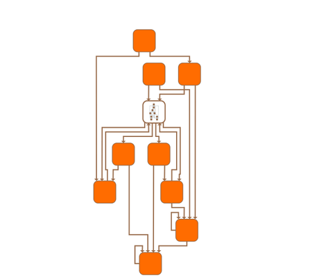

# Deep Zoom Demo

[You can also run this demo online](https://live.yworks.com/demos/view/deep-zoom/index.html).

# Deep Zoom Demo

This demo allows you to seamlessly zoom into the contents of deeply nested group nodes, similar to that is known as "deep zoom" for images and maps.

The graph component does not display the complete graph but only the nesting level that fits the current zoom level. That means that graph items at a higher nesting level are not rendered at all, and the content of group nodes that is too small to provide meaningful interaction is displayed as a static image. When zooming in on such a group node, this image is eventually replaced with real graph elements.

## Things to try

- **Zoom into** a group node so that its entire contents fill the current viewport, and observe that the displayed graphic is automatically replaced by the contents of the group.
- **Zoom out** of a group and observe that its previous nesting layer becomes visible and the content of the group becomes an image again.
- **Toggle** the smooth scrolling button in the toolbar to enable or disable smoothly animated viewport changes.
