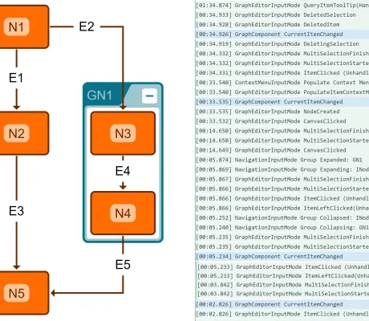

<!--
 //////////////////////////////////////////////////////////////////////////////
 // @license
 // This file is part of yFiles for HTML.
 // Use is subject to license terms.
 //
 // Copyright (c) by yWorks GmbH, Vor dem Kreuzberg 28,
 // 72070 Tuebingen, Germany. All rights reserved.
 //
 //////////////////////////////////////////////////////////////////////////////
-->
# Events Demo

[You can also run this demo online](https://www.yfiles.com/demos/view/events/).

This demo shows the multitude of events provided by the classes [IGraph](https://docs.yworks.com/yfileshtml/#/api/IGraph) and [GraphComponent](https://docs.yworks.com/yfileshtml/#/api/GraphComponent) and the _Input Modes_.

The events are logged to the _Event Log_ panel. Logging can be switched on and off for each _kind of events_ in the respective panel.

When looking for an event that fits your needs, you should generally start looking at the top of the list above and work your way down. In most cases, it is preferable to use events of a particular input mode instead of subscribing to the low-level graph events (which should be reserved for rare, exceptional cases where the layers above won't suffice).

## Things to Try

- Toggle the various event log options to see different kinds of events.
- Create, delete, move, resize and edit graph items.
- Drag and drop nodes, labels or ports from the palette.
- Move the whole graph within the viewport by dragging the mouse (Ctrl\-Drag in Edit Mode).
- Select and deselect graph items.
- Expand, collapse, enter and exit group nodes.
- Toggle the input mode using the "Edit Mode" checkbox.
