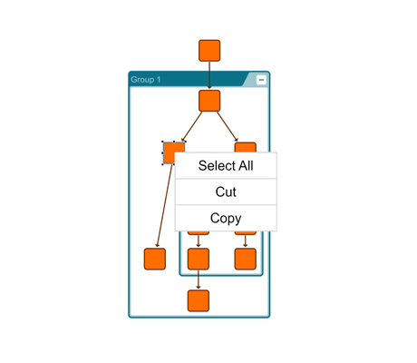

# Graph Editor Demo

[You can also run this demo online](https://live.yworks.com/demos/view/grapheditor/index.html).

# Graph Editor Demo

The Simple Editor demo exhibits a [GraphComponent](https://docs.yworks.com/yfileshtml/#/api/GraphComponent) which enables graph editing via the default [GraphEditorInputMode](https://docs.yworks.com/yfileshtml/#/api/GraphEditorInputMode).

#### Creating Elements (Nodes / Vertices)

Click on an empty location on the canvas.

#### Creating Connections (Edges / Links)

To begin creating an edge, press the left mouse button on an unselected source node, and drag away from the node. Complete the edge creation by releasing the mouse button over a target node. Abort edge creation by pressing the Esc key.

You can optionally create control points (bends) during edge creation. Create the first control point by releasing the mouse button, and subsequent control points by clicking on empty areas of the canvas. Undo control point creation with right-click.

#### Creating and Editing Labels

Press the F2 key while an element or connection is selected.

#### Panning and Zooming

- Move the diagram view by dragging the mouse with the Ctrl key held down. Start dragging on an empty location on the canvas.
- Change the zoom factor with the mouse wheel or the zoom buttons in the toolbar. Display the entire diagram using the "Fit Content" button in the toolbar.

#### Selection

- Select all objects by pressing Ctrl+A.
- Select a single object by clicking on it.
- Select multiple objects by dragging the mouse over the canvas and enclosing all desired elements within the selection rectangle. Or use the Ctrl key when clicking on a node to add it to an existing selection.
- Deselect all items by clicking on an empty part of the canvas.

#### Moving Items

Select the item to be moved, then drag it to its new location.

#### Removing Items

Press the delete key to remove all currently-selected items, or use the delete button in the toolbar.

#### Resizing Elements

Select a node, then drag one of the resizing handles to change the size.

- Hold Shift to keep the aspect ratio for any node.
- Hold Alt to resize around the node's center.

#### Clipboard

- Cut selected elements by pressing Ctrl+X.
- Copy selected elements to the clipboard by pressing Ctrl+C.
- Paste the clipboard's contents into the diagram by pressing Ctrl+V.

There are also buttons for all clipboard operations in the toolbar.

#### Undo/Redo

- Undo edit operations by pressing Ctrl+Z.
- Redo undone operations by pressing Ctrl+Y.

There are also undo/redo buttons in the toolbar.

#### Grouping

- Group selected nodes into a group node by pressing Ctrl+G. A group node sized to the initial contents is created.
- Add or remove a node from the group node by dragging it with the Shift key held down. The group which will be the node's parent is indicated by highlighted corners.
- Deleting a group node removes the group node but not its children.

There are also group/ungroup buttons in the toolbar.

#### Collapsing and Expanding Groups

- Collapse an expanded group node by selecting it and pressing Ctrl+Minus, or by clicking on the Minus button in its top left corner.
- Expand a collapsed group node by selecting it and pressing Ctrl+Plus. or by clicking on the Plus button in its top left corner.

#### Entering and Exiting Groups

- Enter a selected group node by pressing Ctrl+Enter.
- Exit a group node by pressing Ctrl+Backspace.

There are also enter group/exit group buttons in the toolbar.

#### Orthogonal Edge Creation

- Switch orthogonal edges on/off in the toolbar.
- Change the outgoing node side by pressing the space bar while creating an orthogonal edge (before creating a bend).

#### Snapping

- Switch snapping on/off in the toolbar. Drag nodes, edges, and bends near other graph elements to make them snap.
- When snapping is enabled, orthogonal edge segments snap to other graph elements during edge creation.
