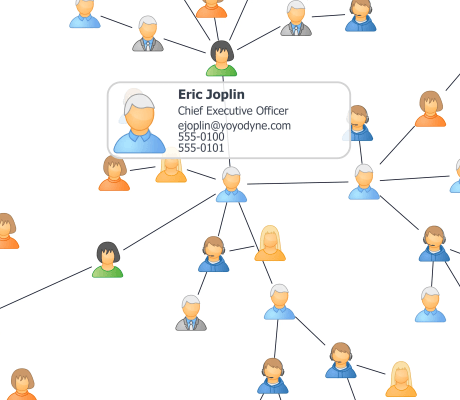

# HTML Popup Demo

[You can also run this demo online](https://live.yworks.com/demos/view/htmlpopup/index.html).

This demo shows HTML pop-up panels that display additional information about a clicked node or edge.

The pop-up is displayed in the [GraphComponent](https://docs.yworks.com/yfileshtml/#/api/GraphComponent) above the graph items but below the scrollbars, and rendered zoom-invariant with a fixed size.

In this demo, a _pop-up_ is shown when clicking a node or an edge. The data are retrieved from a graph item's [ITagOwner#tag](https://docs.yworks.com/yfileshtml/#/api/ITagOwner#tag) property. The template for these pop-ups is defined in the GraphComponent's div and is automatically added to the [CanvasComponent#overlayPanel](https://docs.yworks.com/yfileshtml/#/api/CanvasComponent#overlayPanel) element by the GraphComponent's constructor.

In general, a pop-up can contain arbitrary HTML content, it can be created through JavaScript code or copied over from another part of the DOM, and it can be manually added to the [CanvasComponent#overlayPanel](https://docs.yworks.com/yfileshtml/#/api/CanvasComponent#overlayPanel) of the GraphComponent at any time.

## Things to Try

- Click a node to show information about the person.
- Click an edge to display information about the connection.
- Take a look at the code, especially `HTMLPopupSupport.js`.
