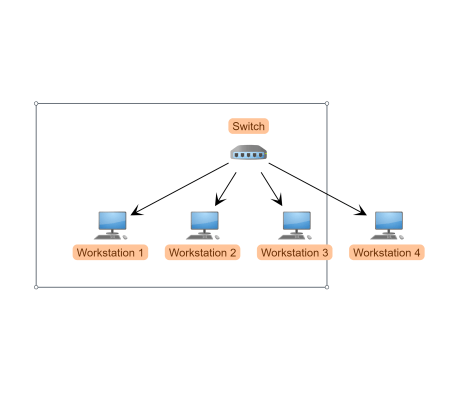

# Image Export Demo

[You can also run this demo online](https://live.yworks.com/demos/view/imageexport/index.html).

# Image Export Demo

This demo shows how to export the whole diagram or a part of it to a PNG image.

## Things to Try

- Resize and move the hatched rectangle to control the region which will be exported.
- _Export_ shows the exported drawing in an HTML Canvas and as PNG image.
- Disable _Export Rectangle Contents_ to export the complete graph instead of the rectangle's region.
- Explore the settings for scale and margin.

## Details

The demo shows an approach that completely runs in the client's browser, as well as an approach for a server-side export. The client-side export is supported by the latest versions of all major browsers. It doesn't work in Internet Explorer 11, whose security settings are too restrictive, and there might be issues in older browsers, especially in Internet Explorer 10 and before.

### Fall-back Strategy

Additionally, this demo shows how to use [canvg](https://github.com/canvg/canvg) as a fallback strategy on client-side export. canvg provides a viable workaround for Internet Explorer whose security settings do not allow the creation of a data URL of a HTML Canvas.

Please note that the canvg result might differ from the original graph visualisation and from the output produced by the primary solution.

This demo loads both of these projects dynamically from their project websites. They are not part of the yFiles for HTML package but available separately under the terms of the MIT license.

### Server-side export

The server-side export is a minimal example of how to export the graph using an external service hosted on a server. It shows the export by a Java Servlet that uses the [Apache Batik SVG Toolkit](https://xmlgraphics.apache.org/batik/) and the [FreeHEP vectorgraphics](http://java.freehep.org/vectorgraphics/), as well as the export via a Node.js express server using [headless Chrome/Puppeteer](https://developers.google.com/web/tools/puppeteer/).

The server-side export button will be enabled, when either of the Node.js or Batik Servlet servers are alive on loading time of the demo. To run the servers, see their respective readme in [`./java-servlet/`](java-servlet/README.html) and [`./node-server/`](node-server/README.html).
