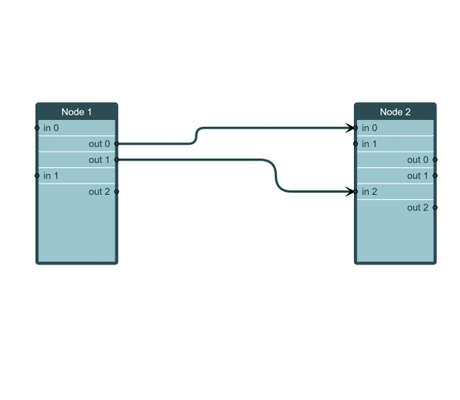

# List Node Demo

[You can also run this demo online](https://live.yworks.com/demos/view/list-node/index.html).

This demo shows how to display a node with sections arranged in rows. The sections can be re-arranged interactively. When a section is moved, its edges are moved as well.

## Things to Try

- Add new rows with the context menu (right click). Note that rows which support outgoing edges have a port on the right side of the node. Rows which support incoming edges have a port that is placed at the left.
- Connect edges to the ports at the rows by dragging from a port. Edges will always go from the right side to the left side of a node, no matter on which side the edge creation was started.
- Move rows up and down by dragging with the mouse.
- Move an entire node by dragging with the mouse at its header.
- Rename nodes and rows by clicking on a node or row label and pressing `F2`.
- Remove rows with the context menu by right-clicking on them.
