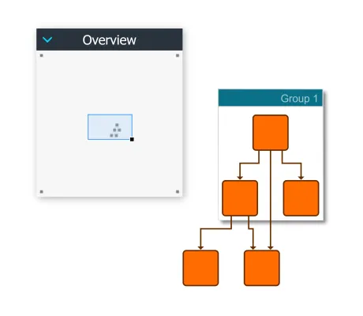

<!--
 //////////////////////////////////////////////////////////////////////////////
 // @license
 // This file is part of yFiles for HTML.
 // Use is subject to license terms.
 //
 // Copyright (c) by yWorks GmbH, Vor dem Kreuzberg 28,
 // 72070 Tuebingen, Germany. All rights reserved.
 //
 //////////////////////////////////////////////////////////////////////////////
-->
# Overview Styling Demo

[You can also run this demo online](https://www.yfiles.com/demos/view/overviewstyles/).

This demo shows different ways to render and style the overview:

- With HTML Canvas by extending [GraphOverviewRenderer](https://docs.yworks.com/yfileshtml/#/api/GraphOverviewRenderer).
- With SVG using a custom [IObjectRenderer](https://docs.yworks.com/yfileshtml/#/api/IObjectRenderer).
- With a [GraphComponent](https://docs.yworks.com/yfileshtml/#/api/GraphComponent) that uses the [OverviewInputMode](https://docs.yworks.com/yfileshtml/#/api/OverviewInputMode).

## Things to Try

Select the rendering technique in the combobox in the toolbar.

## Details

Of the supported rendering modes, Canvas offers the best performance. Using SVG can make sense if you need high fidelity or high detail rendering, especially for smaller graphs. For such use cases, using a `GraphComponent` with `OverviewInputMode` is an option, too.

Keep in mind that the overview usually displays the whole graph at once, and thus complex SVG visualizations can lead to performance issues.
