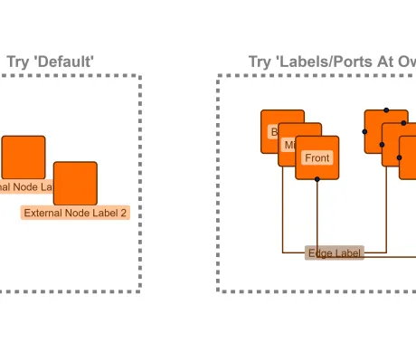

<!--
 //////////////////////////////////////////////////////////////////////////////
 // @license
 // This file is part of yFiles for HTML.
 // Use is subject to license terms.
 //
 // Copyright (c) by yWorks GmbH, Vor dem Kreuzberg 28,
 // 72070 Tuebingen, Germany. All rights reserved.
 //
 //////////////////////////////////////////////////////////////////////////////
-->
# Rendering Order Demo

[You can also run this demo online](https://www.yfiles.com/demos/view/renderingorder/).

## Rendering Order

Sometimes it is necessary to change the render order of graph, e.g. when labels should be rendered in front of their owner but behind another item. This demo shows how to use [GraphModelManager](https://docs.yworks.com/yfileshtml/#/api/GraphModelManager) to configure the rendering order for grouped graphs as well as layer policies for labels and ports.

### Hierarchical Nesting

Each item type is assigned to a specific canvas object group. These groups have a default rendering order from back to front. See [The Z-order of Graph Elements](https://docs.yworks.com/yfileshtml/#/dguide/customizing_view-z_order) for more information about the different [IRenderTreeGroup](https://docs.yworks.com/yfileshtml/#/api/IRenderTreeGroup)s and their default rendering order.

For grouped graphs, we provide some nesting policies to structure nodes and edges in more complex hierarchies. In these cases, some of the canvas object groups may not be used.

### Demo Configurations

- _Default:_ The rendering order that is used by default.
- _Labels / Ports at Owner:_ The labels and ports are rendered on the same z-order as their owner.
- _Edges on Top:_ Edges are rendered on top of the nodes. Note in this case, we also enabled the labels and ports at owner configuration.
- _Group Nodes:_ Maintains the rendering order according to the nesting depth for group nodes while nodes and edges are placed in the separate groups and are not interleaved in the rendering.
- _None:_ Items are placed in their respective canvas object group without considering the nesting hierarchy of the nodes. Usually, this setting is only used when the z-order is managed by a different mechanism.
