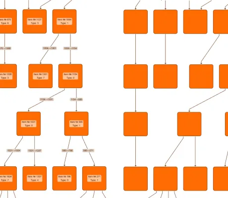

<!--
 //////////////////////////////////////////////////////////////////////////////
 // @license
 // This file is part of yFiles for HTML.
 // Use is subject to license terms.
 //
 // Copyright (c) by yWorks GmbH, Vor dem Kreuzberg 28,
 // 72070 Tuebingen, Germany. All rights reserved.
 //
 //////////////////////////////////////////////////////////////////////////////
-->
# WebGL Label Fading

[You can also run this demo online](https://www.yworks.com/demos/view/webgl-label-fading/).

This demo shows how to achieve a simple _level of detail (LOD)_ display in [WebGL](https://docs.yworks.com/yfileshtml/#/dguide/webgl2) rendering by fading out labels on zoom levels smaller than a chosen threshold.

## Things to try

- Zoom into the graph and observe as labels are faded in at 50% zoom.
- Choose a label fade-out threshold from the dropdown in the toolbar and zoom in and out of the graph to observe the label fading at different zoom levels.

See the sources for details.
