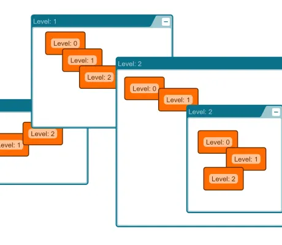

<!--
 //////////////////////////////////////////////////////////////////////////////
 // @license
 // This file is part of yFiles for HTML.
 // Use is subject to license terms.
 //
 // Copyright (c) by yWorks GmbH, Vor dem Kreuzberg 28,
 // 72070 Tuebingen, Germany. All rights reserved.
 //
 //////////////////////////////////////////////////////////////////////////////
-->
# Z-Order Demo

[You can also run this demo online](https://www.yfiles.com/demos/view/zorder/).

This demo customizes editing gestures to keep the z-order of nodes consistent.

## Usage

- Select nodes and use the Raise/Lower/ToFront/ToBack buttons to change their z-orders.
- Group/Ungroup select nodes and see how their relative z-order keeps stable.
- Collapse/Expand group nodes and see how the z-order of their children keep stable.
- Enter/Exit group or folder nodes and see how the z-order of nodes outside the group keep stable.
- Cut/Copy/Paste selected nodes and see how the relative z-order of cut/copied nodes keeps stable when pasting.
- Store the graph to GraphML and load it again to see how the z-order of the nodes keeps stable.
- Undo/Redo any of these operations and see how the z-order is restored.
- A z-order is valid in the graph or in a group, i.e. there is a z-order for all "first level" elements in the graph, as well as group specific z-orders for all elements in the specific groups.
